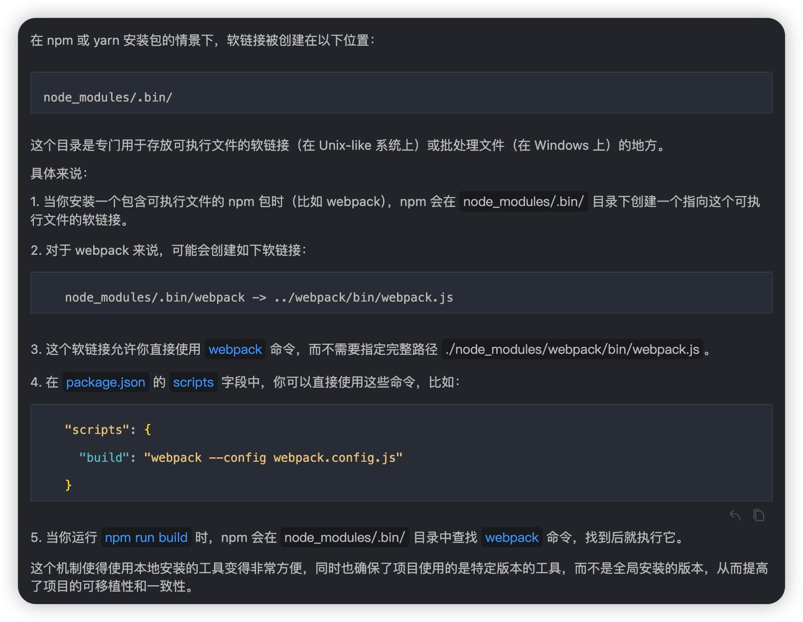

## webpack基础含义

Q1.1 如何安装 本地webpack

A: <br/>

1. 安装 nvm + node + npm/yarn

2. 安装 webpack + webpack-cli

```bash
yarn init -y

yarn add webpack webpack-cli -D
```

----------------------------------------------------------------------------------
Q1.2 webpack的 默认最简使用方法 是什么

A: <br/>

1. 最简单的情况下，webpack是 0配置，开箱即用的==> 执行 `npx webpack` 生成dist目录

2. 如果想修改 打包的相关设置，比如指定入口文件、输出文件的路径，就需要 自定义webpack的配置文件
  - 默认的配置文件名称: webpack.config.js

3. 自定义 webpack的配置文件的 文件名称的方法

3.1 方法1:自定义配置文件名称: 通过 `npx webpack --config [自定义的配置文件名称]` 指定配置文件名称

3.2 方法2: 通过 package.json 的 scripts字段 指定 webpack命令
  - 在 scripts 字段中添加 ` "build": "webpack --config [自定义的配置文件名称]" `
  - 这样就可以通过 `npm run build` 命令来 打包了
  - 这种方法的实现原理是: 模块局部安装 会在node_modules/.bin目录中 生成一个 webpack命令的软链接，指向 webpack-cli
  - 具体原理解释，可见 


## 参考文档

[01-珠峰-webpack基础含义与常用配置1](http://www.zhufengpeixun.com/strong/html/103.1.webpack-usage.html)

[02-珠峰-webpack基础含义与常用配置2](http://www.zhufengpeixun.com/strong/html/26.webpack-1-basic.html)