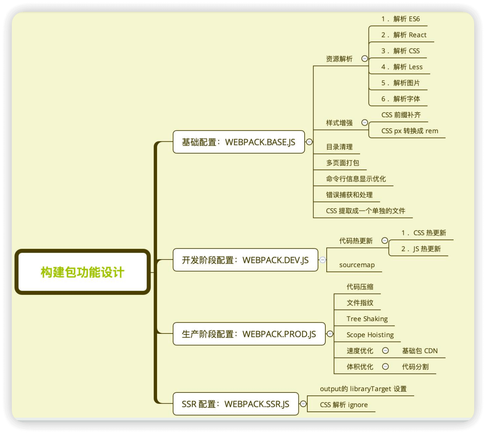

Q1.1 业内一般是如何 配置 ESLint的

A: <br/>

1 创建 .eslintrc.xx 配置文件

S1 方法1: 手动创建 .eslintrc.js 配置文件
```js
// .eslintrc.js
module.exports = {
  // 指定解析器: 将代码转换为 ESLint 可以理解的格式
  // 使用场景: 项目中使用了 非ES标准的语法
  parser: "@babel/eslint-parser", // 旧版本是 babel-eslint
  
  // 继承 airbnb 规则集, 也可以是recommend等其他规则集
  extends: "airbnb",
 
  // 用于定义代码运行的环境，它会预定义一些全局变量
  env: {
    browser: true,
    node: true,
  },
  // 自定义规则
  rules: {
    semi: "error",
  },
};
```

S2 方法2: 使用 eslint 命令行工具创建配置文件

```bash
npm install eslint -D

# 会通过交互式命令行 创建配置文件
eslint --init
```


2 安装相关依赖

```bash
# 安装 ESLint 核心依赖
npm install eslint --save-dev

# 如果使用 airbnb 规则集，需要安装以下依赖
npm install eslint-config-airbnb-base --save-dev

# 如果项目使用了 babel-eslint，需要安装解析器
npm install @babel/eslint-parser --save-dev
```

3 在 package.json 中添加 lint 命令

```json
{
  "scripts": {
    "lint": "eslint src/**/*.{js,jsx}",
    "lint:fix": "eslint src/**/*.{js,jsx} --fix"
  }
}
```

4 创建 .eslintignore 文件(可选)

```shell
# .eslintignore
node_modules
dist
build
```

5 集成到构建流程(可选)
  - 在 webpack 中配置 eslint-loader（或者推荐使用 eslint-webpack-plugin）

```js
// webpack.config.js
const ESLintPlugin = require('eslint-webpack-plugin');

module.exports = {
  // ...
  plugins: [
    new ESLintPlugin({
      extensions: ['js', 'jsx'],
      fix: true // 自动修复
    })
  ]
}
```

6 在 Git 工作流中集成
  - 本地开发阶段增加 precommit 钩子
  - 开发时可以通过 `npm run lint` 检查代码
  - 通过 `npm run lint:fix` 自动修复部分问题

```bash
# 安装 husky 和 lint-staged
npm install husky lint-staged --save-dev
```

```json
// package.json

// husky 是一个用于设置 Git hooks 的工具
// pre-commit 是一个 Git hook，会在代码提交前触发
// 当开发者执行 git commit 时，会自动运行 lint-staged 命令
// lint-staged 只会对 Git暂存区内的文件 进行检查
// 如果文件被 ESLint 修复，将修复后的文件重新添加到暂存区
{
  "husky": {
    "hooks": {
      "pre-commit": "lint-staged"
    }
  },
  "lint-staged": {
    "*.{js,jsx}": [
      "eslint --fix",
      "git add"
    ]
  }
}
```


-----------------------------------------------------------------------------

Q2.1 如何通过 webpack打包 自定义库/组件==> 实现⼀个⼤整数加法库的打包，要求
  - 需要打包 压缩版 和 ⾮压缩版本
  - ⽀持 AMD/CJS/ESM/Script/window.xxx 等引⼊方式

A: <br/>

1 项目结构

/dist
  - large-number.js
  - large-number.min.js

webpack.config.js

package.json

index.js

src
  - index.js


1 完成 大整数加法的 实现==> src/index.js

2 配置 webpack.config.js

```js
// webpack.config.js
const TerserPlugin = require('terser-webpack-plugin');

module.exports = {
  mode: 'none',
  entry: {
    'large-number': './src/index.js',
    'large-number.min': './src/index.js',
  },
  output: {
    filename: '[name].js',
    // 定义库被<script>引入时的 全局变量名
    library: 'largeNumber',
    // 定义库的 输出格式;  umd: 支持所有模块规范
    libraryTarget: 'umd',
    // 指定从库中导出的内容, 从而避免使用时需要使用 xxx.default.fn()
    libraryExport: 'default',
  },
  // 压缩
  optimization: {
    minimize: true,
    // 压缩配置
    minimizer: [
      // 通过 include 设置只压缩 min.js 结尾的⽂件
      new TerserPlugin({
        include: /\.min\.js$/,
      }),
    ],
  }
}
``` 

3 配置 package.json，设置prepublish钩子 + 库的主入口文件

```json
// package.json
{
  "name": "my-large-number",
  "version": "1.0.0",
  "description": "大整数加法库",
  "main": "index.js",
  "scripts": {
    "build": "webpack",
    // 发布前 执行打包
    "prepublish": "webpack"
  }
}
```

4 实现 库的主入口 index.js: 根据不同环境变量 引入不同的打包文件

```js
// index.js
if (process.env.NODE_ENV === 'production') {
  module.exports = require('./dist/large-number.min.js');
} else {
  module.exports = require('./dist/large-number.js');
}
```

5 发布自定义包

```bash
npm login

npm publish
```


-----------------------------------------------------------------------------
Q3.1 如何 监听webpackpack的构建异常，并进行中断处理

A: <br/>

1 为什么需要判断 webpack构建 是否成功
  - CI/CD 的 pipline 或者 发布系统 需要知道当前构建状态，以进行后续处理

2 webpack事件钩子 原理: 
  - 每次构建完成后, 可以通过手动输入 `echo $?` 获取错误码，如果错误码不为 0，则表示构建失败，需要中断处理
  - webpack的 compiler事件钩子 + Node.js 中的 process.exit 规范
    - 0 表示成功完成，回调函数中，err 为 null
    - ⾮ 0 表示执⾏失败，回调函数中，err 不为 null，err.code 就是传给 exit 的数字


3 实现方法1: webpack事件钩子 + process.exit

```js
// webpack.config.js
module.exports = {
  // ... 其他配置
  plugins: [
    {
      apply: (compiler) => {
        // 监听构建失败事件
        compiler.hooks.failed.tap('BuildFailPlugin', (error) => {
          console.error('Webpack 构建失败:', error);
          // 终止进程
          process.exit(1);
        });

        // 监听构建完成事件，检查错误
        compiler.hooks.done.tap('BuildDonePlugin', (stats) => {
          if (stats.hasErrors()) {
            const info = stats.toJson();
            console.error('构建过程发生错误:');
            info.errors.forEach(error => console.error(error));
            process.exit(1);
          }
        });
      }
    }
  ]
};
```

4 业内主流方法: Node.js API 方式 + npm scripts + CI/CD

S1 创建 build.js 监测文件脚本

```js
// scripts/build.js
const webpack = require('webpack');
const config = require('../webpack.config');

// 统一的构建脚本
async function build() {
  const compiler = webpack(config);
  return new Promise((resolve, reject) => {
    compiler.run((err, stats) => {
      // 1. 处理编译器错误（配置错误等）
      if (err) {
        console.error('❌ Webpack 编译器错误:');
        console.error(err.stack || err);
        if (err.details) {
          console.error(err.details);
        }
        reject(err);
        return;
      }

      // 2. 处理编译过程中的错误（语法错误等）
      const info = stats.toJson();
      if (stats.hasErrors()) {
        console.error('❌ 构建过程发生错误:');
        info.errors.forEach(error => console.error(error));
        reject(new Error('Build failed with errors.'));
        return;
      }

      // 3. 输出警告信息
      if (stats.hasWarnings()) {
        console.warn('⚠️ 构建警告:');
        info.warnings.forEach(warning => console.warn(warning));
      }

      // 4. 输出构建信息
      console.log(stats.toString({
        colors: true,    // 让控制台输出带颜色
        modules: false,  // 不显示模块信息
        children: false, // 不显示子进程信息
        chunks: false,   // 不显示 chunk 信息
        assets: true     // 显示资源信息
      }));

      // 5. 清理编译器
      compiler.close((closeErr) => {
        if (closeErr) {
          reject(closeErr);
          return;
        }
        resolve(stats);
      });
    });
  });
}
```

S2 在 package.json 中添加 build 命令

```json
// package.json
{
  "scripts": {
    "build": "cross-env NODE_ENV=production node scripts/build.js",
    "build:dev": "cross-env NODE_ENV=development node scripts/build.js"
  }
}
```

S3 在 CI/CD 中使用

```yaml
# .gitlab-ci.yml
build:
  script:
    - npm ci  # 使用 package-lock.json 安装依赖
    - npm run build  # 执行构建脚本，如果构建失败会自动中断 CI
  artifacts:
    paths:
      - dist/
    expire_in: 1 week
  # 构建失败时的处理
  on_failure:
    - echo "构建失败，发送通知..."
    # 可以调用通知 API 或执行其他操作
```

这种方式的优点:

1. 可维护性好：构建逻辑集中在一个文件中，便于维护 + 错误处理更加统一和清晰

2. 灵活性高：可以根据不同环境（开发、生产）自定义构建流程 + 便于添加自定义的错误处理逻辑

3. 更好的错误反馈：可以自定义错误输出格式 + 可以区分不同类型的错误（编译器错误、构建错误） + 可以集成错误通知系统

4. CI/CD 友好：构建脚本的退出码能正确反映构建状态 + 便于在 CI/CD 环境中集成和使用

5. 性能优化：可以在构建脚本中添加性能监控 + 可以自定义资源分析和优化建议


-----------------------------------------------------------------------------
Q4.1 如何 把 webpack构建配置 抽离成 npm 包

A: <br/>

1 抽离成 npm包 的好处

S1 通用性
  - 业务开发者无需关注构建配置
  - 统一团队构建脚本

S2 可维护性
  - 构建配置合理的拆分
  - README 文档、ChangeLog 文档等

S3 质量
  - 冒烟测试、单元测试、测试覆盖率
  - 持续集成


2 webpack构建配置管理 的可选方案

方案1: 通过多个配置文件管理不同环境的构建，webpack --config 参数进行控制

方案2: 将构建配置设计成一个库，比如：hjs-webpack、Neutrino、webpack-blocks

方案3: 抽成一个工具进行管理，比如：create-react-app, kyt, nwb

方案4: 将所有的配置放在一个文件，通过 --env 参数控制分支选择


3 以方案1为例，构建配置包的 总体设计是:

S1 通过多个配置文件管理不同环境的 webpack 配置
  - 基础配置：webpack.base.js
  - 开发环境：webpack.dev.js
  - 生产环境：webpack.prod.js
  - SSR环境：webpack.ssr.js 
  …… 

S2 抽离成一个 npm包 统一管理
  - 规范：Git commit日志、README、ESLint 规范、Semver 规范
  - 质量：冒烟测试、单元测试、测试覆盖率和 CI

S3 通过 webpack-merge 组合配置
  - 合并配置: module.exports = merge(baseConfig, devConfig)


S4.1 构建配置包的功能设计图示



S4.2 构建配置包的 目录结构
  - lib: 放置 源代码
  - test: 放置 测试代码
  - README.md: 项目说明
  - CHANGELOG.md: 变更日志
  - .eslintrc.js: ESLint 配置
  - package.json: 项目配置
  - index.js: 配置包的 入口文件

```md
+ |- /test

+ |- /lib
+ |-   webpack.dev.js
+ |-   webpack.prod.js
+ |-   webpack.ssr.js
+ |-   webpack.base.js

+ |- README.md
+ |- CHANGELOG.md
+ |- .eslinrc.js
+ |- package.json
+ |- index.js
```


-----------------------------------------------------------------------------
Q4.2 如何配置 npm构建包的 ESLint规范

A: <br/>

1 因为是基础构建包，所以所使用的 ESLint 规范不需要 第三方开发库，可以使用基础的 eslint-config-airbnb-base

2 在 .eslintrc.js 中配置 ESLint 规范

```js
// .eslintrc.js
module.exports = {
  // 指定解析器，@babel/eslint-parser
  parser: "@babel/eslint-parser",
  // 继承 airbnb 规则集
  extends: "airbnb-base",
  // 指定代码运行的环境
  env: {
    browser: true,
    node: true
  }
};
```

3 在 package.json 中添加 「自动检查 和 格式问题自动修复」 命令

```json
// package.json
{
  "scripts": {
    "lint": "eslint ./lib --fix"
  }
}
```

4 需要注意，构建包里的 很多依赖都是 dependencies，需要注意哪些是 开发依赖，哪些是 生产依赖
  - devDependencies: 开发时用到的依赖（如 ESLint、测试工具等）
  - dependencies: 构建过程中必需的依赖（如 webpack、loaders、plugins 等）


