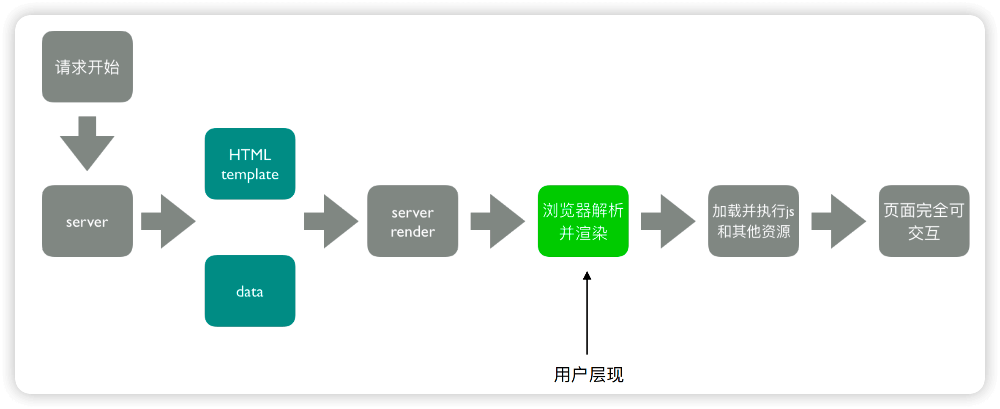
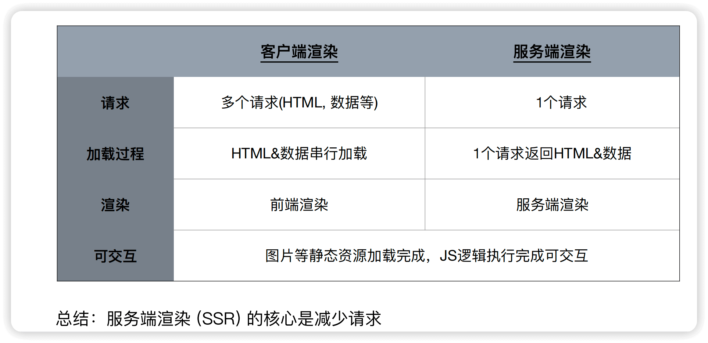

Q1.1 为什么引入 SSR, 它有什么优点

A: <br/>

1.1 客户端渲染(CSR) 的过程是:
  
浏览器开始加载==> HTML加载成功，开始加载数据==> 数据加载成功，渲染页面==> 加载图片资源==> 图片加载成功，页面可交互

1.2 SSR 的过程是:

客户端发起请求==> 服务端接收到请求，读取HTML模板==> 服务端将HTML模板和data结合，生成完整的HTML==> 服务端将HTML返回给客户端==> 客户端 解析并渲染页面==> 加载 并 执行JS和其他资源==> 页面可交互

用图表示为:



2.1 SSR的特点:
  - 所有模板等资源 都存储在服务端
  - 内⽹机器 拉取数据更快
  - 1个 HTML 返回所有数据

CSR 和 SSR 的 特点对比 见下图:



2.2 SSR的优点:
  - 首屏加载快
  - 有利于SEO


----------------------------------------------------------
Q2.1 如何实现 最基础的SSR

A: <br/>

1.1 创建node/server端的 app实例入口 server/index.js

```js
// server/index.js

// 处理点1: hack兼容node环境下的 window全局变量
if (typeof window === 'undefined') {
    global.window = {};
}

// 处理点2: 引入express/ renderToString(核心依赖方法)
//        SSR(webpack打包后的 内容JS文件)/  template(webpack打包后的 HTML模板)
const express = require('express');
const { renderToString } = require('react-dom/server');
const SSR = require('../dist/search-server');
const template = fs.readFileSync(path.join(__dirname, '../dist/search.html'), 'utf-8');

// 处理点3: 创建express实例
const server = (port) => {
    const app = express();
    // 托管静态资源
    app.use(express.static('dist'));
    // 处理/search 请求
    app.get('/search', (req, res) => {
        const html = renderMarkup(renderToString(SSR));
        res.status(200).send(html);
    });
    // 监听端口
    app.listen(port, () => {
        console.log('Server is running on port:' + port);
    });
};

// 启动服务
server(process.env.PORT || 3000);

// 处理点4: 创建 renderMarkup 方法, 用于返回 HTML内容
const renderMarkup = (html) => {
  return`<!DoCTYPE html>
<html>
  <head>
    <title>服务端渲染</title>
    <meta charset="utf-8"/>
  </head>
  <body>
    <div id="app">${html}</div>
  </body>
</html>`;
}
``` 


2.1 实现 SSR的 JS入口文件

```js
// src/search/index-server.js

// 注意点1: 模块引入方式需要使用 commonjs
const React = require('react');
class Search extends React.Component {}

// 注意点2: 导出组件需要使用 commonjs规范
module.exports = <Search />;
```


3.1 node/server端 创建针对SSR的 webpack.ssr.js 配置文件

```js
// webpack.ssr.js

// 注意点1: 模块引入方式需要使用 commonjs
const webpack = require('webpack');

// 创建 setMPA 方法, 用于生成 entry 和 htmlWebpackPlugins
const setMPA = () => {
  const entry = {};
  const htmlWebpackPlugins = [];
  // 注意点2: 入口需要是 SSR的JS入口文件
  const entryFiles = glob.sync(path.join(__dirname, './src/*/index-server.js'));
  // ....
  return {
    entry,
    htmlWebpackPlugins
  }
}

const { entry, htmlWebpackPlugins } = setMPA();

module.exports = {
  entry,
  output: {
    path: path.join(__dirname, 'dist'),
    // 注意点3: 文件名需要是 [name]-server.js, 要和server/index.js中引入的 SSR文件名一致
    filename: '[name]-server.js',
    // 注意点4: 使用 umd 格式, 便于在 node/browser 都可以被使用
    libraryTarget: 'umd'
  },
}

```

3.2 创建使用webpack.ssr.js 的 npm script 命令

```js
// package.json
"scripts": {
  "build:ssr": "webpack --config webpack.ssr.js"
}
```