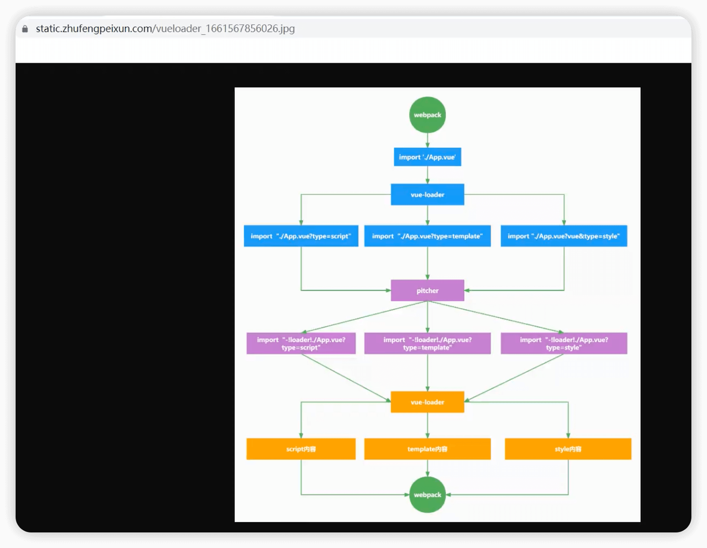

## 一 实现准备

Q1 mini-vue-loader的项目准备工作有哪些

A:

1 安装依赖和初始化项目

2 配置webpack.config.js文件

3 执行打包

这部分内容不具体赘述，具体可参考[Vue Loader实现-珠峰文档-起步部分](http://www.zhufengpeixun.com/strong/html/156.vue-loader.html)


## 二 具体实现

Q1 概述 vue-loader的执行流程/实现原理

A:

1 ...==> npm scripts... ==> 依次执行 new Plugin()==>

2 在 VueLoaderPlugin()的 apply()方法里，会代理增强 compile.options.module.rules = [pitcherRule, ...clonedRules, templateRule, ...rules]==>

3 src/main.js里会 import './App.vue' ==> .vue文件后缀命中了webpack.config.js里的 vueRule==>

4 第一次执行VueLoader: 根据.vue里的 template/script/style块，把.vue内容转化为 带有查询参数标识的【文件导入】==>

5 webpack后续黑盒编译过程LoaderRunner==> ...==> import '绝对路径/App.vue?vue&type=xxx&lang=yyy&id=zzz&scoped=bbb&idx=ccc'==>
  - 5.1: 导入的资源类型/ 查询参数 会触发 cloneRule里的resource + resourceQuery校验，原理是 在资源文件的resource后拼接lang属性值，再和rule进行匹配
  - 5.2: 命中了compile.options.module.rules里的 [pitcherLoader, templateLoader..., vueLoader]==> pitcherLoader定义了pitch钩子==>
  - 5.3: 执行pitcherLoader.pitch: 按配置数组顺序，获取到 所有命中处理的【.vue?查询参数】的 loaders==> 调用genProxyModule()==>
  - 5.4: 执行genProxyModule: 根据所有依赖loaders + 当前引入的资源文件, 拼接出【行内loader引入】字符串==>
  - 5.5: 默认导出/全部导出 拼接成的【行内loader引入】字符串==> `export {default} from "-!loaderA!loaderB!loaderC!./App.vue??vue&type=xxx&lang=yyy&id=zzz&scoped=bbb&idx=ccc"`

> PS: 从而可知一个技巧: 在 plugin/loader.pitch里，都可以增减处理 某一资源的依赖 loaders内容 <br/>
>   - 比如在 VueLoaderPlugin里，就增加了 templateLoader <br/>
>   - 比如在 pitcherLoader.pitch里，就可以针对 style块，在cssLoader后插入了stylePostLoader

6 转化为【行内loader引入】后，会从右到左执行 loader==> 第2次执行 vueLoader() ==>

7 vueLoader()==> select.selectBlock() 分别处理不同类型的type块==>
  - 7.1: type为script: 通过SFCCompiler.compileScript(descriptor,options)，获取到【script的JS字符串内容】，并传递给下一个loader/webpack 处理并返回

  - 7.2: type为template: 通过descriptor.template获取到temObj==> templateLoader() ==>
    - 通过SFCCompiler.compileTemplate(temObj,options)，获取到【转化后的JS字符串内容】，并传递给下一个loader/webpack 处理并返回

  - 7.3: type为style: 通过descriptor.styleItem，获取到style的CSS字符串内容cssObj==> stylePostLoader()==>
    - 通过SFCCompiler.compileStyle(cssObj,options)，获取到【转化后的css字符串内容】，并传递给下一个loader/webpack 处理并返回==> cssLoader/styleLoader...


其流程图见下:




---------------------------------------------------------------------------------
Q2 具体列出 vue-loader的 实现思路

A:

0 webpack前置执行过程==>

1 webpack.config.js==> 依次执行 new Plugin()的 constructor构造函数==>

2 new VueLoaderPlugin()的 apply()方法==>
  - 2.1 定义 resourceQuery+loader类型的 pitcherRule

  - 2.2 定义 resourceQuery+loader类型的 templateRule

  - 2.3 克隆 除了vueRule的 所有其他 compile.options.module.rules，记作cloneRules
    - 注意点1: cloneRules内部 使用resource+resourceQuery，替换掉 原有的使用test 文件后缀的匹配规则
    - 注意点2: 之所以要去除掉vueRule，是因为 原有rules中已经包含了处理vue文件的rule，它不需要被改成resourceQuery后还重复放入

  - 2.4: 把新定义的 pitcherRule、templateRule、cloneRules 插入到 compile.options.module.rules的 合适位置
    - 注意点1: 合适位置 是指按 [pitcherRule, ...clonedRules, templateRule, ...rules]，从右到左顺序执行normal-loader

> 一句话总结new Plugin()的 apply()方法: 代理并增强了 原有compile.options.module.rules的内容 <br/>
> 即把 resourceQuery类型 的pitcherRule、templateRule、cloneRules 插入到 compile.options.module.rules的 合适位置


3 webpack后续黑盒编译过程LoaderRunner==> ...==> import './App.vue' ==> .vue文件后缀命中了vueRule==>

4 第1次 执行VueLoader==>
  - 4.1: 通过 descriptor，获取到 template/script/style的不同类型块的 内容
  - 4.2: 把 script内容转化为 带有查询参数标识的【文件导入】
  - 4.3: 把 template内容转化为 带有查询参数标识的【文件导入】
  - 4.4: 把 style内容【逐个】转化为 带有查询参数标识的【文件导入】
  - 4.5: 如果存在 scoped样式，就在 script上挂载 __scopeId属性
  - 4.6: 拼接出 返回内容，最后再 默认导出script

```js
// 4.1 descriptor上有script、template、styles等属性
const { descriptor } = compiler.parse(source);

// 4.2的转化内容
import script from "./App.vue?vue&type=script&id=540548bc&lang=js"

// 4.3的转化内容
import { render } from "./App.vue?vue&type=template&id=540548bc&scoped=true&lang=js"
script.render = render

// 4.4的转化内容
import "./App.vue?vue&type=style&index=0&id=540548bc&scoped=true&lang=css"

// 4.6的导出内容 
export default script
```

5-1 webpack后续黑盒编译过程LoaderRunner==> ...==> import '绝对路径/App.vue?vue&type=script&id=540548bc&lang=js'

==> 导入的资源类型/ 查询参数 会触发 cloneRule里的resource + resourceQuery校验，原理是 在资源文件的resource后拼接lang属性值，再和rule进行匹配

==> 命中了compile.options.module.rules里的 [pitcherLoader, vueLoader]==> pitcherLoader定义了pitch钩子

==> 执行pitcherLoader.pitch

5-2 执行pitcherLoader.pitch==>
  - 5-2.1: 按配置数组顺序，获取到 所有命中处理的【.vue?查询参数】的 loaders，再排除掉 pitcherLoader
  - 5-2.2: 根据query(loaderCtx.resourceQuery)里是否含有 type为style的查询参数，来特殊处理style块内容，由于type为script，所以暂略跳过 
  - 5-2.3: 调用genProxyModule: 拼接出 行内loader引入 
  - 5-2.4: 默认导出 拼接成的【行内loader引入】字符串

5-3 执行genProxyModule==>
  - 5-3.1: 获取到 所有命中loaders的 绝对路径，存入到loaderAbsolutePaths数组里
  - 5-3.2: 获取到 当前引入的资源文件的 完整绝对路径：loaderCtx.resource
  - 5-3.3: 把所有loaderAbsolutePaths和当前资源文件进行拼接，返回【行内loader引入】字符串

```js
// 5-3: 返回的结果：【行内loader引入】形如
const inLineRequest = "-!../vue-loader/index.js!./App.vue?vue&type=script&id=540548bc&lang=js"

// 5-2: 默认导出【行内loader引入】
export {default} from "-!../vue-loader/index.js!./App.vue?vue&type=script&id=540548bc&lang=js"
```


6-1 webpack后续黑盒编译过程LoaderRunner==> ...==> import '绝对路径/App.vue?vue&type=template&id=540548bc&lang=js'

==> 导入的资源类型/ 查询参数 会触发 cloneRule里的resource + resourceQuery校验，原理是 在资源文件的resource后拼接lang属性值，再和rule进行匹配

==> 命中了compile.options.module.rules里的 [pitcherLoader, templateLoader, vueLoader]==> pitcherLoader定义了pitch钩子

==> 执行pitcherLoader.pitch

6-2 执行pitcherLoader.pitch==>
  - 6-2.1: 按配置数组顺序，获取到 所有命中处理的【.vue?查询参数】的 loaders，再排除掉 pitcherLoader
  - 6-2.2: 根据query(loaderCtx.resourceQuery)里是否含有 type为style的查询参数，来特殊处理style块内容，由于type为template，所以暂略跳过
  - 6-2.3: 调用genProxyModule: 拼接出 行内loader引入
  - 6-2.4: 默认导出 拼接成的【行内loader引入】字符串

6-3 执行genProxyModule==>
  - 6-3.1: 获取到 所有命中loaders的 绝对路径，存入到loaderAbsolutePaths数组里
  - 6-3.2: 获取到 当前引入的资源文件的 完整绝对路径：loaderCtx.resource
  - 6-3.3: 把所有loaderAbsolutePaths和当前资源文件进行拼接，返回【行内loader引入】字符串

```js
// 6-3: 返回的结果：【行内loader引入】形如
//      注意和5-2相比，会多增加一个templateLoader处理
const inLineRequest = "-!../vue-loader/templateLoader.js!../vue-loader/index.js!./App.vue?vue&type=template&id=540548bc&scoped=true&lang=js"

// 6-2: 默认导出【行内loader引入】
//      注意和6-2相比，不是默认导出，而是导出所有内容

export * from "-!../vue-loader/templateLoader.js!../vue-loader/index.js!./App.vue?vue&type=template&id=540548bc&scoped=true&lang=js"
```


7-1 webpack后续黑盒编译过程LoaderRunner==> ...==> import '绝对路径/App.vue?vue&type=style&index=0&id=540548bc&scoped=true&lang=css'

==> 导入的资源类型/ 查询参数 会触发 cloneRule里的resource + resourceQuery校验，原理是 在资源文件的resource后拼接lang属性值，再和rule进行匹配

==> 命中了compile.options.module.rules里的 [pitcherLoader, styleLoader, cssLoader, vueLoader]==> pitcherLoader定义了pitch钩子

==> 执行pitcherLoader.pitch


7-2 执行pitcherLoader.pitch==>
  - 7-2.1: 按配置数组顺序，获取到 所有命中处理的【.vue?查询参数】的 loaders，再排除掉 pitcherLoader
  - 7-2.2: 根据query(loaderCtx.resourceQuery)里是否含有 type为style的查询参数，来特殊处理style块内容，style，所以需要执行
    - 7-2.3: 在loaders(此时它的值为[styleLoader, cssLoader, vueLoader])里，找到cssLoader的索引位置 cssLoaderIdx
    - 7-2.4: 在cssLoader之后，插入stylePostLoaderPath， 即 loaders = [styleLoader, cssLoader, stylePostLoaderPath, vueLoader]
    - 7-2.5: 调用genProxyModule: 拼接出 行内loader引入
    - 7-2.6: 默认导出 拼接成的【行内loader引入】字符串


7-3 执行genProxyModule==>
  - 7-3.1: 获取到 所有命中loaders的 绝对路径，存入到loaderAbsolutePaths数组里
  - 7-3.2: 获取到 当前引入的资源文件的 完整绝对路径：loaderCtx.resource
  - 7-3.3: 把所有loaderAbsolutePaths和当前资源文件进行拼接，返回【行内loader引入】字符串

```js
// 7-3: 返回的结果：【行内loader引入】形如 
//      注意 会多增加一个stylePostLoader处理
const inLineRequest = "-!../node_modules/style-loader/dist/cjs.js!../node_modules/css-loader/dist/cjs.js!../vue-loader/stylePostLoader.js!../vue-loader/index.js!./App.vue?vue&type=style&index=0&id=540548bc&scoped=true&lang=css"

// 7-2: 默认导出【行内loader引入】，注意样式是使用默认导出
export {default} from "-!../node_modules/style-loader/dist/cjs.js!../node_modules/css-loader/dist/cjs.js!../vue-loader/stylePostLoader.js!../vue-loader/index.js!./App.vue?vue&type=style&index=0&id=540548bc&scoped=true&lang=css"
```

8 webpack黑盒执行流程==> ...=> 按从右到左顺序执行 export vvv from "-!LoaderA!LoaderB!./App.vue?vue&type=xxx&lang=yyy"==> 第2次执行vue-loader

9 第2次执行vue-loader: 查询参数中存在type且有值，执行 select.selectBlock()==>

10 select.selectBlock()==>
  - 10.1: type为script: 通过SFCCompiler.compileScript(descriptor,options)，获取到【script的JS字符串内容】，并传递给下一个loader/webpack 处理并返回
  - 10.2: type为template: 通过descriptor.template，获取到template的HTML字符串内容temObj，并传递给下一个loader/webpack 处理并返回==> templateLoader处理==>
    - 10.2.1: templateLoader()==> 通过SFCCompiler.compileTemplate(temObj,options)，获取到【转化后的JS字符串内容】，并传递给下一个loader/webpack 处理并返回
    - PS: 如果存在scoped属性，则会在【转化后的JS字符串内容】里内部，添加上 <div data-v-id="id">的HTML属性

  - 10.3: type为style: 通过descriptor.styleItem，获取到style的CSS字符串内容cssObj，并传递给下一个loader/webpack 处理并返回==> stylePostLoader处理==>
    - 10.3.1: stylePostLoader()==> 通过SFCCompiler.compileStyle(cssObj,options)，获取到【转化后的css字符串内容】，并传递给下一个loader/webpack 处理并返回
    - PS: 需要注意，经过stylePostLoader编辑后的 css字符串内容，如果有scoped属性，则会在 css内容里添加 xxx[data-v-id]属性选择器限制
    - 10.3.2: 后续会继续传递给 css-loader/ style-loader/...... 处理


具体代码，参见 [mini-vue-loader](https://github.com/gmYuan/frontedStack/tree/main/Q1.1-vue-loader%E5%AE%9E%E7%8E%B0/02-code)


## 三 阅读文档

[01 Webpack案例—— vue-loader原理分析](https://juejin.cn/post/6937125495439900685)

[02 一文读懂 vue-loader 原理](https://juejin.cn/post/7028410359207690247)

[03 深入vue-loader原理](https://juejin.cn/post/6994468137584295973)

[04 vue-loader原理流程真～～解析](https://juejin.cn/post/7013991508281917454)


