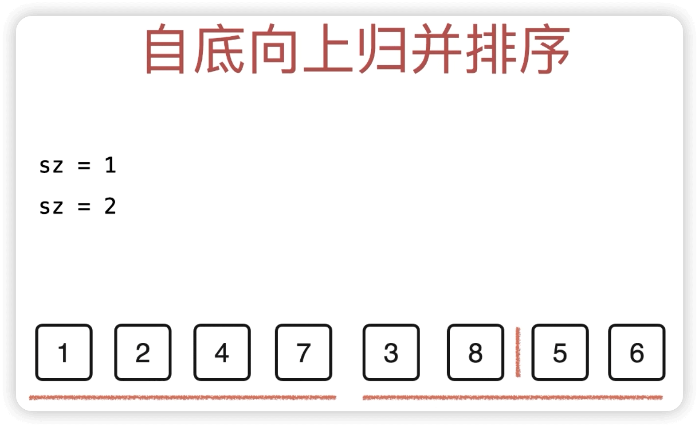
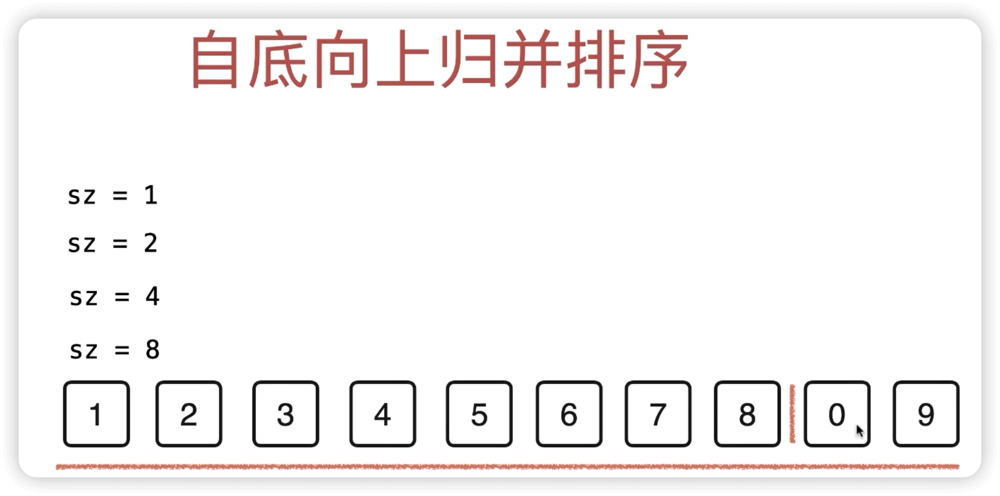

## 归并排序相关


Q1: 自顶向下实现【归并排序】的大致实现思路是什么

A: <br/>

1. 递归思想: 排序[l, r]的数组，转化其更小规模的问题，其实就是：
  - 排序[l, mid]的数组A 和 [mid+1, r]的数组B
  - 对 [l, mid]的有序数组A 和 [mid+1, r]的有序数组B，进行 排序并合并

2. 举例说明: 
```
                0~10
            /         \
          0~5         6~10
         /    \       /   \ 
      0~2      3~5  ...   ...
      / \     /   \
    0~1  2   3~4   5
    /  \
 0 (0) 1 (1)
```

merge(0,0,1) 即 merge(0, 1)  ==> merge(0,1,2)  即merge(0,2)

merge(3,3,4) 即 merge(3, 4)  ==> merge(3,4,5)  即merge(3,5)

merge(0,2,5) 即 merge(0,5)

右侧过程类似，直到最后完成 merge(0, 10)

---------------------------------------------------------------------
Q2: 如何用代码【自顶向下】实现归并排序

A: <br/>

归并排序- 自顶向下  时间复杂度: O(nlogn)  空间复杂度: O(n)

```ts
function mergeSort(nums: number[]): number[] {
  innerSort(nums, 0, nums.length - 1)
  return nums
};

// 排序 arr里 [l,r]范围内的成员
function innerSort(arr, l, r) {
  // 递归终止条件：拆分到了每组只有1个元素
  if (l >= r) return;
  const mid = (l + r) >> 1;
  // 合并左子区间
  innerSort(arr, l, mid);
  // 合并右子区间
  innerSort(arr, mid + 1, r);

  // 对左右有序区间 进行合并
  // 优化点1: 只有在arr[mid]的值 > arr[mid+1]值的时候，才需要进行merge排序操作
  // 因为对于2个有序区间而言，如果mid值已经小于mid+1了，那么他们整个区间就已经是有序的了
  // 这样优化后，对完全有序的数组，归并排序的复杂度是 0(n)的
  if (arr[mid] > arr[mid+1]) {
    mergePart(arr, l, mid, r);
  }
}

//合并2个有序区间: arr[l, mid] 和 arr[mid+1, r]
function mergePart(arr, l, mid, r) {
  // 拷贝一份原数组，因为后续原数组内容会被更改
  const copy = [...arr];
  // 易错点: rdx是从l开始的
  let rdx = l, i = l, j = mid + 1;
  while (i <= mid && j <= r) {
    if (copy[i] <= copy[j]) arr[rdx++] = copy[i++];
    else arr[rdx++] = copy[j++];
  }
  // 处理左右侧还剩下的有序内容，直接赋值即可
  while (i <= mid) arr[rdx++] = copy[i++];
  while (j <= r) arr[rdx++] = copy[j++];
}
```

如果追求内存优化，可以每次不拷贝整个arr, 而是只拷贝[l,r]范围内的成员，代码是:

```js
function mergeSort(nums: number[]): number[] {
  innerSort(nums, 0, nums.length - 1)
  return nums
};

// 排序 arr里 [l,r]范围内的成员
function innerSort(arr, l, r) {
  if (l >= r) return;
  let mid = l + ((r - l) >> 1);
  innerSort(arr, l, mid);
  innerSort(arr, mid + 1, r);
  // 优化: 如果arr[mid] <= arr[mid+1]，则arr[l, r]已经有序
  if (arr[mid] > arr[mid + 1]) {
    mergePair(arr, l, mid, r);
  }
}

function mergePair(arr, l, mid, r) {
  // 临时数组，用于存储合并后的 [l, r]范围的排序结果，注意其下标是从0开始的
  let temp = new Array(r - l + 1);
  // 正确排序 + 把结果存入临时数组
  let i = 0, p1 = l, p2 = mid + 1;
  while (p1 <= mid && p2 <= r) {
    temp[i++] = arr[p1] <= arr[p2] ? arr[p1++] : arr[p2++];
  }
  while (p1 <= mid) temp[i++] = arr[p1++];
  while (p2 <= r) temp[i++] = arr[p2++];
  // 将排序结果从临时数组拷贝回原数组
  for (let i = 0; i < temp.length; i++) {
    arr[l + i] = temp[i];
  }
}
```

-----------------------------------------------------------------------
Q3: 自底向上实现【归并排序】的大致实现思路是什么

A: <br/>

1. 每轮以 1/2/4/.../2^n 的车厢节点数量size，划分车厢an和bn

2. 两两合并被划分的车厢[anStart, anEnd], [bnStart, bnEnd]:
  - 易错点1: 要考虑根据size划分车厢后，最后一部分车厢b 的总数是有可能少于size的
  - 易错点2: [l, mid]和[mid+1, r]中， mid和r的取值要举例 size=2理解
  - 易错点3: 两两合并的中止条件是：不存在b车厢

3. mergePart: 排序并合并[l, mid]数组a 和 [mid+1, r]数组b

即: 按 2*size的规模 划分车厢 an,bn + 两两合并an,bn + mergePart






---------------------------------------------------------------------
Q4: 如何用代码 自底向上实现归并排序

A: <br/>

```ts
function mergeSort(nums) {
  let len = nums.length;
  // 按 2*size的规模 划分车厢 an和bn
  for (let size = 1; size < len; size *= 2) {
    // 两两合并 被划分的车厢[anStart, anEnd], [bnStart, bnEnd]:
    // [aStart, aEnd]和[bStart, bEnd]， 即[l, mid] 和 [mid+1 , r]的值分别是：
    // [i, i+size-1], [i+size, Math.min(i+size + size-1, len-1) ]

    // 易错点1: mid的值是 i+size-1，而不是i+size, 是因为size是从1而不是从索引0开始的，
    //   可以通过 举例size=1/size=2具体理解

    // 易错点2: r的值是 Math.min(i+size+size-1, len-1)，而不是i+size+size
    //  - 是i+size+size-1，而不是i+size+size的原因，本质上和 易错点1是一样的，同样
    //    可以通过举例size=1/size=2理解

    //  - 要考虑根据size划分车厢后，最后一部分车厢b 的总数是有可能少于size的，也就是说，此时
    //    最后一个节点的索引值是len-1, 而不一定是 i+size+size-1

    // 易错点3: i的更新条件是 i+=2*size，而不是i++
    //  - 这里i的含义其实表示的是，每一对即将合并的车厢[an,bn]的 anStart索引
    //    由于每队合并车厢的 bnEnd索引是 i+2*size-1
    //    所以，下一对车厢的 a'n+1 位置索引i的值就应该是 i+=2*size

    // 易错点4: 车厢的配对中止条件是bnStart值小于len，否则说明没有bn车厢需要被合并
    for (let i = 0; i + size < len; i += 2 * size) {
      // 优化点1: 只有aEnd值 > bStart值时，才需要对a,b车厢进行排序处理
      if (nums[i + size - 1] > nums[i + size]) {
        mergePart(nums, i, i + size - 1, Math.min(i + 2 * size - 1, len - 1));
      }
    }
  }
  return nums;
}

// 排序[l, mid] 和 [mid+1, r] 2个数组，返回排好序的合并后的 1个数组
function mergePart(arr, l, mid, r) {
  // 拷贝一份原数组，因为后续原数组内容会被更改
  const copy = [...arr];
  // 双指针处理
  let rdx = l,
    i = l,
    j = mid + 1;
  while (i <= mid && j <= r) {
    if (copy[i] <= copy[j]) arr[rdx++] = copy[i++];
    else arr[rdx++] = copy[j++];
  }
  // 处理左右侧还剩下的有序内容，直接赋值即可
  while (i <= mid) arr[rdx++] = copy[i++];
  while (j <= r) arr[rdx++] = copy[j++];
}
```

