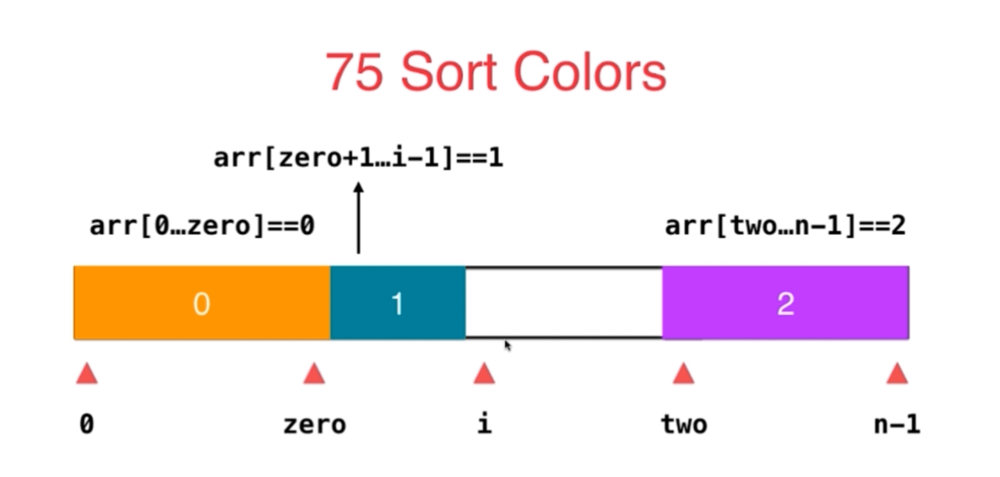

# LeetCode75- 颜色分类

## 实现思路

1 关键特征：成员值是【有限的】; 排序

2 方法1:  首尾指针 + 循环不变量

3 参考实现: <br/>
[类似实现思路](https://leetcode.cn/problems/sort-colors/solution/kuai-su-pai-xu-partition-guo-cheng-she-ji-xun-huan/)


## 代码实现

方法1: 三路快排，具体实现略(可见leetCode912), 时间复杂度O(nlogn)

方法2: 三路快排partiton——  时间复杂度: O(n);  空间复杂度: O(1) 
  - 方法1没有利用到 "元素成员值只有 1/2/3"的性质，通过利用这个性质，可以通过只实现三路快排的partition, 来简化时间复杂度

```ts

function sortColors(nums: number[]): void {
  // [0, p0] === 0; [p0+1, i/p1) === 1; [p2, len-1] === 2
  let p0 = -1, p2 = nums.length, i = 0;
  while (i < p2) {
    const val = nums[i]
    if (val === 0) {
      swap(nums, ++p0, i++);
    } else if (val === 1) {
      i++;
    } else {
      swap(nums, --p2, i);
    }
  }
};

function swap(arr, i, j) {
  [arr[i], arr[j]] = [arr[j], arr[i]];
}
```

用一张图理解过程为: <br/>
